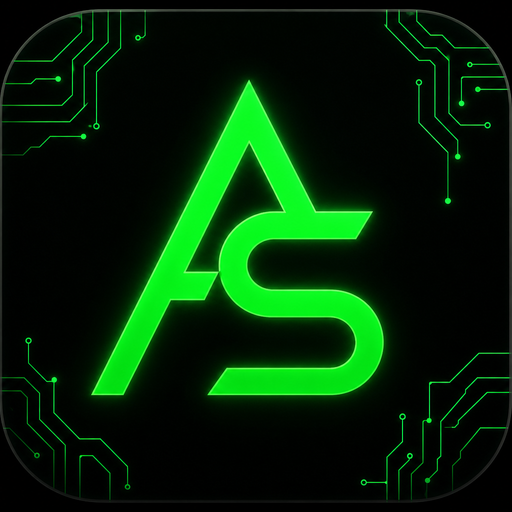

<p align="center">
  
</p>

<h1 align="center">Agent Smith</h1>

<p align="center">
  <strong>Local-first AI agent built for small models.</strong><br>
  Run Gemma, Qwen, and other 7B–35B models through LM Studio — auto-routing sends
  coding tasks to the autonomous build engine and everything else to chat + host tools —
  with real edits and a safety net you can undo.
</p>

<p align="center">
  <a href="https://github.com/GhostWrk/Agent-Smith/releases/tag/v1.0.0"></a>
  <a href="LICENSE"></a>
  
  
  
  
</p>

<p align="center">
  <a href="https://github.com/GhostWrk/Agent-Smith/releases/latest"><strong>Download Linux build</strong></a>
  &nbsp;·&nbsp;
  <a href="#quick-start">Quick start</a>
  &nbsp;·&nbsp;
  <a href="#documentation">Documentation</a>
  &nbsp;·&nbsp;
  <a href="CHANGELOG.md">Changelog</a>
</p>

---

## What is Agent Smith?

**Agent Smith** is a desktop coding assistant that turns a locally hosted language model into a capable build partner. Unlike chat-only UIs, it can **read your project, edit files, run commands, verify results, and show you exactly what changed** — all without sending your code to the cloud.

It is designed for developers who want **privacy, control, and predictable behavior** from smaller open models (7B–35B) that are fast enough to run on consumer hardware.

> Your machine. Your model. Your codebase. Agent Smith stays on your side of the wire.

---

## Why Agent Smith?

| | |
|---|---|
| **Runs fully local** | Pair with [LM Studio](https://lmstudio.ai/) — no API keys, no data leaving your machine. |
| **LM Studio is the only provider** | One local endpoint for chat, code and embeddings — no cloud keys required (the v48 Kimi K3 cloud toggle was retired in v50). Strict-API hardening (tool pairing, canonical wire shape) stays for any OpenAI-compatible server. |
| **Built for small models** | Gemma harness, forgiving tool parsing, compact prompts, and auto-tuned runtime profiles so 7B–35B models can actually ship code. |
| **Smart persistent memory** | Local embedding-backed memory for recall across runs. Load an embedding model in LM Studio alongside your chat/code model before using memory features. |
| **Auto-routed run types** | One conversation — coding tasks get the autonomous build loop (Code Mode), everything else gets chat + whole-machine host tools. `code:` / `agent:` prefix forces a route. |
| **Trust you can verify** | Every edit is snapshotted. Review a unified diff when a run finishes. **Revert All** restores the exact pre-run state. |
| **Plans that persist** | Non-trivial Code runs write `.agentsmith/PLAN.md` and `IMPLEMENT.md` so long tasks survive restarts. |
| **Ships with guardrails** | Completion gates, syntax checks, command/path policies, and an audit log — automation with brakes, not blind autopilot. |
| **Desktop + phone** | Electron app with a frameless UI; optional LAN or tunnel access and a QR code to open the cockpit on your phone. |
| **Extensible** | Plugin system for custom tools, hooks, and commands ([`docs/PLUGINS.md`](docs/PLUGINS.md)). |

---

## Auto-routing — one conversation, two run types (v51.2)

Agent Smith keeps one continuous conversation but routes **each message** to the right engine (`src/shared/taskClassifier.js`):

| Route | Triggered when… | What runs |
|-------|-----------------|-----------|
| **Code Mode** | a coding task is detected — building/creating an app, script, site or tool; fixing/debugging code; refactoring; porting between languages | Autonomous build loop on your workspace — plan phases, patch-first editing with ledger snapshots, verify-before-done, Revert All |
| **Agent / Chat path** | anything else — conversation, questions, research, file organization, disk/process inspection, downloads | Host-control tools (shell, files anywhere, web search & fetch, memory) — plain chat when no tools are needed |

- The classifier scores strong coding signals (verb + artifact type, "in/using <language>", bug-fix phrases), context signals (.ext, stack traces, git verbs) and file-management/research negatives. Ambiguous input stays conversational.
- **Force a route** with a prefix: `code: fix the parser` or `agent: just explain this code`. The token is stripped before it reaches the model.
- While a Code run is live (plan awaiting approval, build in flight), follow-up messages stay inside that code conversation automatically.

### Code Mode — the build engine

Describe what you want built. Agent Smith plans, implements, runs tests, and grinds toward green — automatically.

- Multi-tool turns with phase gates (explore → implement → verify)
- Patch-first editing with ledger snapshots before every write
- Live activity timeline in chat so you see every tool call
- Completion gate blocks premature "done" on broken output
- **Revert All** when you want a clean slate

### Agent Mode — your local operator

When you need the model to act across your machine:

- Run shell commands and manage processes
- Read, write, and delete files anywhere on the host (catastrophic paths blocked by policy)
- Search the web and fetch pages as text (`web_search`, `fetch_url`)
- Review and undo consequential actions via the audit log

### Chat Mode — zero friction

Plain LLM streaming when you do not want tools in the loop.

---

## Download

Pre-built **Linux** installers (v1.0.0):

| Format | File | Notes |
|--------|------|-------|
| **AppImage** | [`Agent Smith-52.0.0.AppImage`](https://github.com/GhostWrk/Agent-Smith/releases/download/v1.0.0/Agent%20Smith-52.0.0.AppImage) | Portable — `chmod +x` and run |
| **Debian/Ubuntu** | [`agent-smith_1.0.0_amd64.deb`](https://github.com/GhostWrk/Agent-Smith/releases/download/v1.0.0/agent-smith_1.0.0_amd64.deb) | `sudo dpkg -i` then `sudo apt -f install` if needed |

All releases: **[github.com/GhostWrk/Agent-Smith/releases](https://github.com/GhostWrk/Agent-Smith/releases)**

For macOS and Windows, clone the repo and use the quick start below — the launcher handles platform-specific dependencies.

---

## Quick start

### 1. Load your local models in LM Studio

Open **LM Studio** and start the local server at `http://localhost:1234`.

Load both models before launching Agent Smith:

1. A chat/code model, such as Gemma or Qwen.
2. A local embedding model for memory/search.

Keep LM Studio running while Agent Smith is open. No cloud API key is required.

### 2. Launch Agent Smith

**Easiest** — works on Linux, macOS, and Windows:

```bash
# Linux / macOS
bash run.sh
```

```bat
:: Windows (or double-click run.cmd)
run.cmd
```

The launcher installs dependencies for **your** platform on first run. If you copied the project from another OS, it detects the mismatch and reinstalls automatically.

**Manual:**

```bash
npm install
npm start
```

### 3. Point it at your project

1. Set your workspace with **📍 Here I am**
2. Turn on **CODE MODE** in the sidebar
3. Describe the task — watch the timeline as tools run
4. Review the diff; hit **Revert All** if you want to roll back

**Model tip:** If LM Studio uses just-in-time loading, the model list may look empty at first. Pick your model once in the dropdown — Agent Smith remembers it.

**Memory tip:** If memory or recall says embeddings are unavailable, return to LM Studio and confirm the embedding model is loaded and the local server is still running.

### Provider: LM Studio (local)

Agent Smith talks to one local endpoint — [LM Studio](https://lmstudio.ai/)'s OpenAI-compatible server (default `http://127.0.0.1:1234`). No cloud keys, no telemetry. The v48 Kimi K3 cloud toggle was retired in v50; LM Studio is the only model provider as of v51.2.

---

## Feature highlights

**Intelligence & tuning**
- Runtime auto-tune — model-aware context and temperature profiles ([`docs/RUNTIME_PROFILE.md`](docs/RUNTIME_PROFILE.md))
- Gemma harness — system folding and tool JSON preamble for small-model reliability
- Smart persistent memory — local embeddings provide recall without cloud services; load the embedding model in LM Studio before using memory features
- Zero-setup cockpit — Build Mode plans then grinds to green; Hardware Guard shows live RAM/VRAM/GPU

**Safety & trust**
- Change ledger with byte-exact **Revert All**
- Agent action log — review and undo file writes and deletes
- `commandPolicy` and `pathPolicy` refuse catastrophic shell and filesystem targets

**Workflow**
- Live preview panel for web projects
- Headless `browser_verify` for HTML acceptance checks in Code Mode
- Durable `.agentsmith/` artifacts for multi-step missions
- Optional WhatsApp linking and phone QR for remote cockpit access

**Polish**
- Frameless desktop shell with custom window controls
- Official Linux desktop entry via `npm run install-desktop`
- Matrix-inspired UI with a modern card overlay

---

## Documentation

| Doc | Purpose |
|-----|---------|
| [`SMITH.md`](SMITH.md) | Product doctrine and design law |
| [`docs/CODE_MODE.md`](docs/CODE_MODE.md) | Code Mode deep dive |
| [`AGENTS.md`](AGENTS.md) | Repo map for contributors and AI assistants |
| [`PROTOCOL.md`](PROTOCOL.md) | Protocol and security detail |
| [`docs/architecture.md`](docs/architecture.md) | System layout |
| [`docs/PLUGINS.md`](docs/PLUGINS.md) | Plugin development |
| [`CHANGELOG.md`](CHANGELOG.md) | Release history |

---

## For developers

### Build from source

```bash
npm install
npm run build:renderer
npm start
```

### Linux packages

Build on Linux (electron-builder does not cross-compile cleanly from Windows):

```bash
npm install
npm run dist              # → AppImage + .deb in release/
npm run install-desktop   # optional: app-menu launcher + taskbar icon
```

### Verification

```bash
npm test
npm run ship-check
node scripts/verify-main-ipc.js
npm run build:renderer
```

### Project layout

| Path | Role |
|------|------|
| `src/code/` | Code Mode engine — turn loop, tools, completion gate |
| `src/main/` | Electron main process — services and IPC |
| `src/renderer/` | UI — chat, sidebar, timeline, mode toggles |
| `src/shared/` | Cross-process helpers — policies, channels, persona |
| `tests/` | Unit and integration tests |
| `docs/` | Architecture, harness, and mode documentation |

### Sharing across operating systems

**Do not zip `node_modules`.** Native binaries (`esbuild`, `electron`) are platform-specific. Send source only; recipients run `npm install` on their machine.

---

## Privacy & sharing installers

Installers (AppImage/.deb) contain **only app code** — no API keys, no chat history, no memory, no accounts. All app data lives in your local user profile (`~/.config/Agent Smith/`), never in the project directory or the packages. Sharing an installer is safe; a recipient gets a clean app and enters their own settings. Just don't share your `~/.config/Agent Smith/` profile folder — that's where your data is.

---

## License

MIT — see [`LICENSE`](LICENSE).

<p align="center">
  <sub>Agent Smith v1.0.0 · Built for local models, built for builders.</sub>
</p>